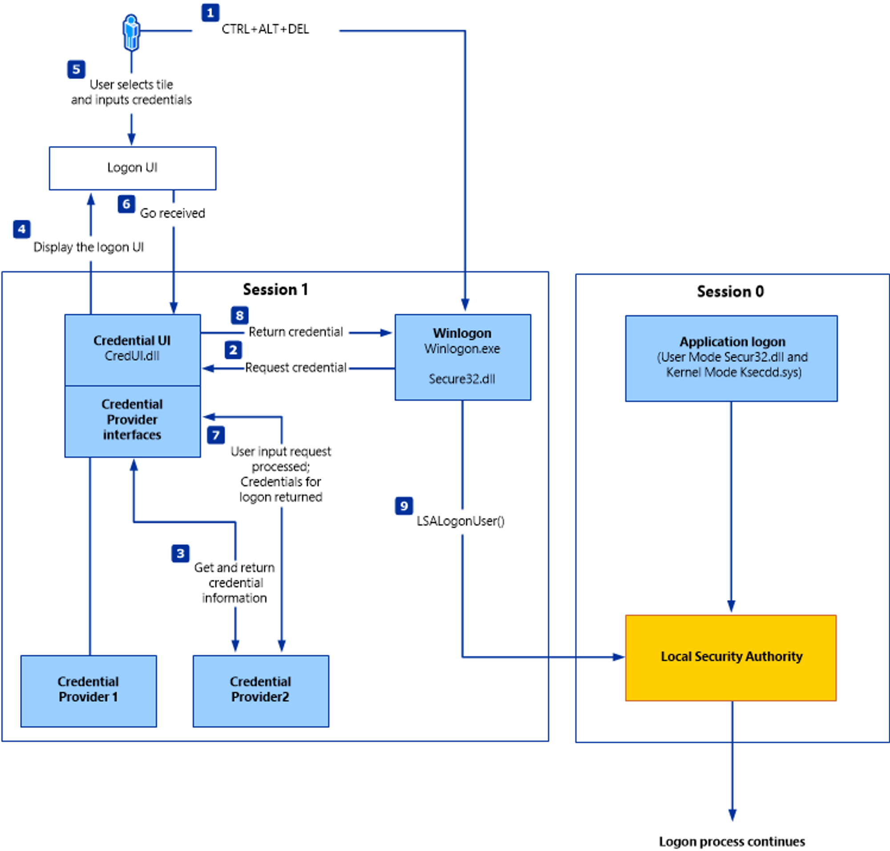

# Windows Authentication Process

<figure><figcaption></figcaption></figure>

| Authentication Packages | Description                                                                                                                                                                                                                                                    |
| ----------------------- | -------------------------------------------------------------------------------------------------------------------------------------------------------------------------------------------------------------------------------------------------------------- |
| `Lsasrv.dll`            | The LSA Server service both enforces security policies and acts as the security package manager for the LSA. The LSA contains the Negotiate function, which selects either the NTLM or Kerberos protocol after determining which protocol is to be successful. |
| `Msv1_0.dll`            | Authentication package for local machine logons that don't require custom authentication.                                                                                                                                                                      |
| `Samsrv.dll`            | The Security Accounts Manager (SAM) stores local security accounts, enforces locally stored policies, and supports APIs.                                                                                                                                       |
| `Kerberos.dll`          | Security package loaded by the LSA for Kerberos-based authentication on a machine.                                                                                                                                                                             |
| `Netlogon.dll`          | Network-based logon service.                                                                                                                                                                                                                                   |
| `Ntdsa.dll`             | This library is used to create new records and folders in the Windows registry.                                                                                                                                                                                |

[MSV](https://docs.microsoft.com/en-us/windows/win32/secauthn/msv1-0-authentication-package) is an authentication package in Windows that LSA calls on to validate logon attempts against the SAM database.

`WDIGEST` is an older authentication protocol enabled by default in `Windows XP` - `Windows 8` and `Windows Server 2003` - `Windows Server 2012`. LSASS caches credentials used by WDIGEST in clear-text. This means if we find ourselves targeting a Windows system with WDIGEST enabled, we will most likely see a password in clear-text. Modern Windows operating systems have WDIGEST disabled by default.

[Kerberos](https://web.mit.edu/kerberos/#what\_is) is a network authentication protocol used by Active Directory in Windows Domain environments. Domain user accounts are granted tickets upon authentication with Active Directory. This ticket is used to allow the user to access shared resources on the network that they have been granted access to without needing to type their credentials each time. LSASS `caches passwords` , `ekeys` , `tickets` , and `pins`associated with Kerberos.

It is possible to extract these from LSASS process memory and use them to access other systems joined to the same domain.

#### **Kerberos Protocol Refresher**

* The `TGT - Ticket Granting Ticket` is the first ticket obtained on a Kerberos system. The TGT permits the client to obtain additional Kerberos tickets or `TGS`.
* The `TGS - Ticket Granting Service` is requested by users who want to use a service. These tickets allow services to verify the user's identity.

When a user requests a `TGT`, they must authenticate to the domain controller by encrypting the current timestamp with their password hash. Once the domain controller validates the user's identity (because the domain knows the user's password hash, meaning it can decrypt the timestamp), it sends the user a TGT for future requests. Once the user has their ticket, they do not have to prove who they are with their password.

If the user wants to connect to an MSSQL database, it will request a Ticket Granting Service (TGS) to The Key Distribution Center (KDC), presenting its Ticket Granting Ticket (TGT). Then it will give the TGS to the MSSQL database server for authentication.

#### **UAC Limits Pass the Hash for Local Accounts**

UAC (User Account Control) limits local users' ability to perform remote administration operations. When the registry key `HKLM\\SOFTWARE\\Microsoft\\Windows\\CurrentVersion\\Policies\\System\\LocalAccountTokenFilterPolicy` is set to 0, it means that the built-in local admin account (RID-500, "Administrator") is the only local account allowed to perform remote administration tasks. Setting it to 1 allows the other local admins as well.

**Note:** There is one exception, if the registry key `FilterAdministratorToken` (disabled by default) is enabled (value 1), the RID 500 account (even if it is renamed) is enrolled in UAC protection. This means that remote PTH will fail against the machine when using that account.

#### Overpass the Hash

The `Pass the Key`or `OverPass the Hash`approach converts a hash/key (rc4\_hmac, aes256\_cts\_hmac\_sha1, etc.) for a domain-joined user into a full `Ticket-Granting-Ticket (TGT)`

## Credential Manager

`C:\Users[Username]\AppData\Local\Microsoft[Vault/Credentials]\`

<figure><figcaption></figcaption></figure>
